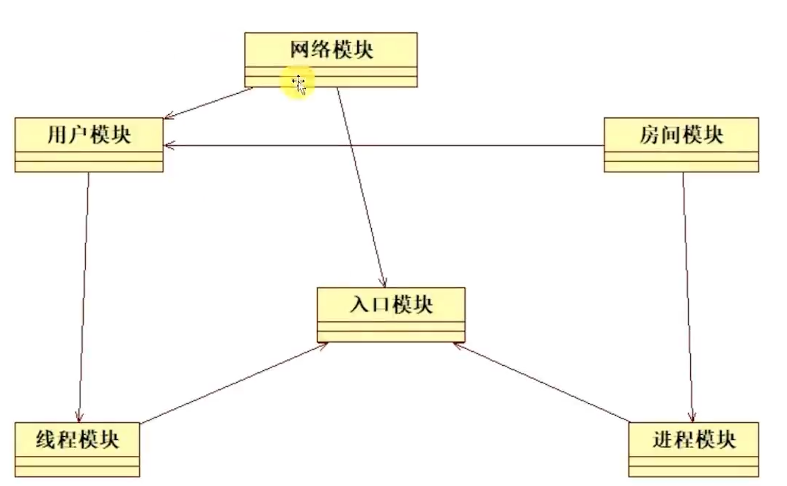
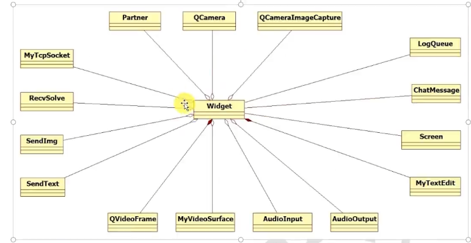
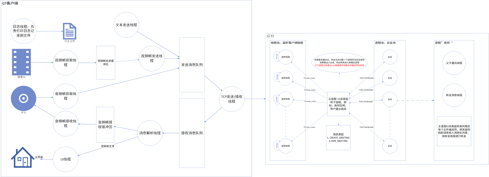

# 云会议

# 服务端

## 1.项目解读

### 1.1项目代码结构

#### 1.1.1源码文件

| main.cpp         | 主程序入口代码         |
| ---------------- | ---------------------- |
| error.cpp        | 错误信息反馈模块       |
| msg.h            | 消息定义               |
| netheader.h      | 消息类型和图片格式定义 |
| unp.h            | 自定义头文件           |
| unpthread.h      | 自定义线程             |
| unpthread.cpp    | 自定义线程             |
| wrapunix.cppunix | 接口扩展               |
| net.cpp          | API函数封装网络模块    |
| room.cpp         | 房间模块               |
| userdeal.cpp     | 用户处理模块           |


#### 1.1.2资源文件

| Makefile | make编译文件 |
| -------- | ------------ |

widget.ui		界面布局

### 1.2项目架构

本项目整体属于典型的 Cs 架构(客户端一一服务器架构)中的客户端。
服务器端采用主从多进程架构。
进程数量可以依据实际服务器的硬件性能和需求指定进程和线程的数量上限整个采用一种自适应的结构，依据产品需求，通过启动参数随时调整。


### 1.3项目模块关系



### 1.4项目模块功能

| 入口模块 | 初始化其他模块，并且孵化线程和进程 |
| -------- | ---------------------------------- |
| 线程模块 | 处理用户信息                       |
| 进程模块 | 创建和维护进程，加载房间模块函数   |
| 网络模块 | 提供网络收发功能                   |
| 用户模块 | 维护用户消息处理                   |
| 房间模块 | 提供房间处理                       |


### 1.5项目流程

#### 1.5.1应用初始化

#### 1.5.2网络数据处理


## 2.项目技术栈

### 2.1多进程编程

这里的每个房间采用独立进程来处理，一方面保证了各个房间数据的私密性，一方面也加强了各个房间的稳定性。
由于进程天然具有内存隔离的特性，所以各个房间的数据不会意外串访。

另外进程的独立性也使得某个房间崩溃的时候，不会让其他房间立刻也一起崩溃。

如果采用多线程来做，一个线程的崩溃，可能导致整个进程的崩溃，进而使得其他房间也失去服务。

### 2.2多线程编程

为了提高服务器对网络数据处理的效率，采用了多线程的模式来处理网络数据。

另外将数据的收发和数据的处理也进行了分离。

接收数据的线程并不会处理数据，而是转发给其他线程或者进程进行处理。

这样能够快速进入下一个数据的接收过程。

避免因为长时间得不到处理而导致客户端失去响应。


### 2.3网络编程

1.Epoll 模型更为复杂，开发和维护成本更高。

2.涉及视频传输的服务器，其瓶颈往往是带宽而不是其他硬件资源。也就是并发量往往不会太大，一般在 200左右。因为一个用户 500k 的带宽，200 个用户意味着 100M 的带宽这个带宽成本已经非常高了。
3.视频会议中一个房间的人数并不会太夸张，往往是几十到上百。更大规模的视频会议,，需要的是直播而不是视频会议。因为超过一百规模的会议，不可能所有用户同时进行网络视频，这个是带宽无法承受的。而且这样的会议也会有主讲人。这种场景下，直播会更方便我的目标是做一个小巧的视频会议系统，而不是大型的直播系统综上所述，我选择select 而非epoll。
网络编程
我认为前者更适合我的这个项目。


### 2.4视频会议服务器

简单的视频会议服务器核心功能其实是供房间服务。
比如房间的创建和销毁。
用户加入和离开房间。
用户在房间中获得的消息转发服务等等。

视频数据在服务器也只是一个普通的数据包，只是尺寸可能大一点点而已。

所以这里服务器采用了 linux 系统，这种系统内存占用较小的操作系统。

这样可以腾出更多资源来开启房间进程，提供更高的服务上限，最大可能的提高硬件资源的利用率


## 3.在linux 部署

```shell
make clean
make

./app 0.0.0.0 8888 2 4						//启动服务端，0.0.0.0是全部ip,8888是端口，2进程4线程
```


# 客户端

## 1.项目解读

### 1.1项目代码结构

#### 1.1.1源码文件

| Audiolnput.h     | Audiolnput.cpp     | 录音                |
| ---------------- | ------------------ | ------------------- |
| AudioOutput.h    | AudioOutput.cpp    | 播放（声音）        |
| chatmessage.h    | chatmessage.cpp    | 聊天信息            |
| logqueue.h       | logqueue.cpp       | 日志队列            |
| main.cpp         |                    | 入口函数            |
| mytcpsocket.h    | mytcpsocket.cpp    | 网络通信   网络封包 |
| mytextedit.h     | mytextedit.cpp     | 文本编辑控件        |
| myvideosurface.h | myvideosurface.cpp | 视频显示控件        |
| netheader.h      | netheader.cpp      | 网络包模块          |
| partner.h        | partner.cpp        | 房间信息            |
| recvsolve.h      | recvsolve.cpp      | 数据接收模块        |
| screen.h         | screen.cpp         | 屏幕工具模块        |
| sendimg.h        | sendimg.cpp        | 图片发送            |
| sendtext.h       | sendtext.cpp       | 文字发送            |
| widget.h         | widget.cpp         | 主窗口              |


#### 1.1.2资源文件

| widget.ui | 界面布局 |
| --------- | -------- |

### 1.2项目架构

本项目整体属于典型的 Cs 架构(客户端一一服务器架构)中的客户端。
客户端采用qt的信号和槽机制来实现前端展示和后台数据交互的对接


### 1.3项目类关系



### 1.4项目类功能

| Audiolnput          | 录音         |
| ------------------- | ------------ |
| AudioOutput         | 播放声音     |
| QCamera             | 摄像头       |
| QCameralmageCapture | 截屏         |
| ChatMessage         | 聊天消息     |
| LogQueue            | 日志队列     |
| MyTcpSocket         | 网络通信     |
| MyTextEdit          | 文字输入窗框 |
| MyVideoSurface      | 视频播放组件 |
| Partner             | 房间信息     |
| RecvSolve           | 数据接收模块 |
| Screen              | 屏幕信息     |
| Sendlmg             | 图片发送模块 |
| SendText            | 文本发送模块 |
| Widget              | 主窗口       |


### 1.5项目流程

#### 1.5.1应用初始化

入口函数 main ->

屏幕初始化 Screen::init() ->

窗口初始化 Widget::Widget(QWidget*parent) ->

​		开启日志LogQueue

​		控件初始化

​		视频传输初始化

​		网络传输初始化

​		文字信息传输初始化

​		摄像头初始化

​		接收处理初始化

​		音频初始化


#### 1.5.2消息发送

用户点击发送按钮一>
on_sendmsg_clicked 响应一>

发送PushText信号一>

SendText::push_Text响应一>

消息入 textqueue 队列一>

SendText::run(线程函数)响应一>

加入queue_send 队列一>

MyTcpSocket::run(线程函数)响应一>

MyTcpSocket::sendData 响应-->

QTcpSocket::write 最终执行发送

#### 1.5.3视频发送

Widget::cameralmageCapture  捕获摄像头帧画面->
发射信号pushimg一>
Sendlmg::lmageCapture-->
pushToQueue入队列一>
Sendimg::run 出队列一>
入队列queue send->
MyTcpSocket;:run(线程函数)响应-->
MyTcpSocket::sendData 响应一>
QTcpSocket;:write 最终执行发送

#### 1.5.4 接收数据

信号 readyRead-->

MyTcpSocket::recvFromSocket-->

queue_recv 入队列-->

线程函数 RecvSolve::run 响应-->

queue_recv出队列一>
发射信号datarecv一>
Widget::datasolve 响应一>

消息处理

## 2.项目技术栈

### 2.1多线程编程

利用多线程来处理网络收发、视频帧传输、消息发送、消息接收等等过程。

其中视频帧传输属于高频触发内容，使用线程避免其对 UI线程的过度占用。

而消息发送和消息接收从网络收发线程中剥离出来，这样让消息处理过程不至于干扰网络收发过程。网络收发只高效处理收发队列，而对消息进行编码封包等操作可以完全不参与。这些编码和封包操作放在消息收发线程里面!按照需要自行处理。

考虑到除了视频传输消息之外，其他消息触发频率大多数都比较低，这样的形式可以提高网络线程的利用效率。即多个消息并行处理，最后生成发送数据队列，交给网络线程全力发送避免了个别消息处理的高耗时导致整个收发过程的阻塞!

### 2.3网络编程

使用了 Qt的网络编程技术。

利用信号和槽来处理网络收发。
这种形式极大的简化了网络处理过程。
使用者可以专注于数据的处理而不是网络流程的控制。


### 2.4协议封装


网络包结构：

| 消息类型 | 四字节       |
| -------- | ------------ |
| 消息数据 | 参考消息长度 |
| 消息长度 | 四字节       |
| 房间地址 | 四字节       |

消息类型：

```
IMG SEND = 0,
IMG RECV,
AUDIO_SEND,
AUDIO_RECV,
TEXT_SEND,
TEXT_RECV,

CREATE_MEETING,
EXIT_MEETING,
JOIN_MEETING,
CLOSE_CAMERA,

CREATE_MEETING_RESPONSE = 20,
PARTNER_EXIT = 21,
PARTNER_JOIN = 22,
JOIN_MEETING_RESPONSE = 23,
PARTNER_JOIN2 = 24,
RemoteHostClosedError = 40,
OtherNetError =41
```

消息长度 消息数据的长度，单位字节

房间地址 标记房间的地址信息


### 2.5视频会议服务器

视频采用QCamera类来获取摄像头内容，通过QAudiolnput来获取音频数据

将画面和声音数据同步传输出去，然后经由服务器转化，从而实现远程视频会议需求





# 项目问题

如何实现进程池？其作用是什么？

如何实现线程池？其作用是什么？

为什么网络通信使用select 而不是ep...

进程间通信有哪些方法？

用户加入房间的过程简单描述一下

请描述一下房间中传输视频信息和。。

linux下信号是什么？如何处理。。

如何自定义信号处理过程？

linux线程间传输有哪些方法？


简单介绍一下项目

如何设计该项目的

如何实现视频会议功能的

本机的视频是如何同步到其他客户端的

客户端如何解决卡顿问题的

通信协议是如何设计的

结合项目，qt的信号和槽机制

如何将网络通信数据同步到。。。

如何处理用户离线问题的